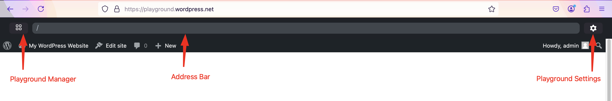
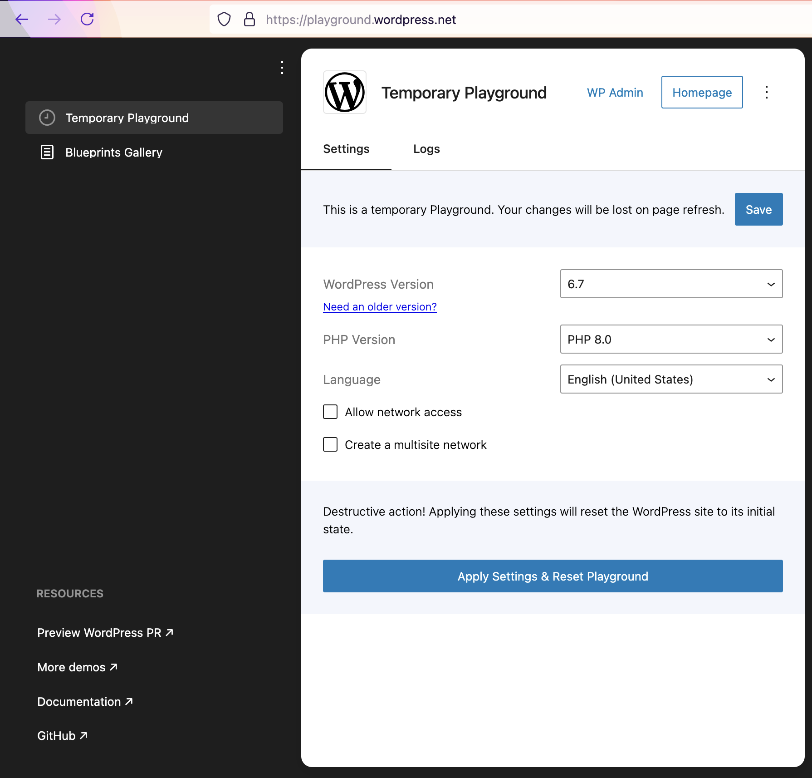
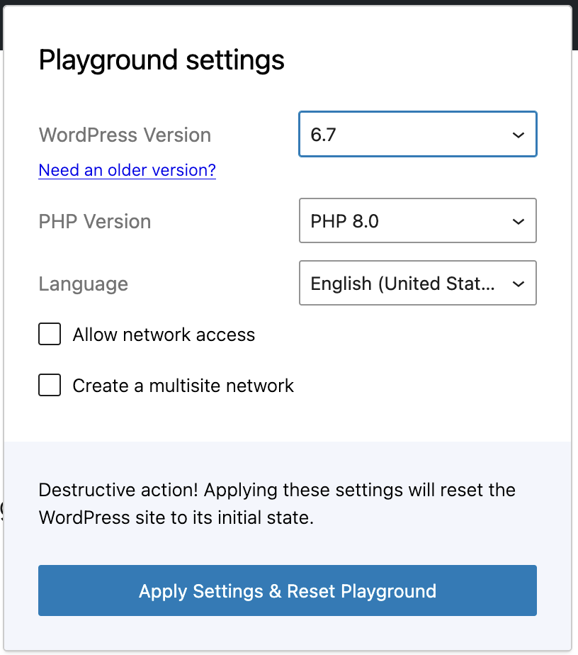

# WordPress Playground web instance

[https://playground.wordpress.net/](https://playground.wordpress.net/) is a versatile web tool that allows developers to run WordPress in a browser without needing a server. This environment is particularly useful for testing plugins, themes, and other WordPress features quickly and efficiently.

Some key features:

-   **Browser-based**: No need for a local server setup.
-   **Instant Setup**: Run WordPress with a single click.
-   **Testing Environment**: Ideal for testing plugins and themes.

Via [Query Params](/developers/apis/query-api/) we can directly load in the Playground instance things such as a specific version of WordPress, a theme, a plugin or a more complex setup via blueprints (check [here](/quick-start-guide#try-a-block-a-theme-or-a-plugin) some examples).

The Playground interface consists of three key sections:

-   **Playground Manager**

-   **Address Bar**

-   **Playground Settings**

Each of these sections provides essential functionalities for managing the WordPress instance.

:::tip

You need to activate "Network access" to be able to browse for [plugins](https://w.org/plugins) and [themes](https://w.org/themes) from your WordPress instance.
:::

#

## 1. Playground Manager

The Playground Manager offers two key tabs:

### a) Temporary Playground

This section allows users to create a temporary WordPress instance for testing. The available options include:

-   **WordPress Version**: Choose from the latest stable version, release candidates (RC), and older versions.

-   **PHP Version**: Select the PHP version for compatibility testing.

-   **Language**: Set the WordPress interface language.

-   **Network Access**: Enable or disable internet access for the playground.

-   **Multisite Network**: Activate the multisite functionality to test networked sites.

**Note**: Changes made in the Temporary Playground are lost upon page refresh.

Additionally, users can:

-   **Export to GitHub:** Save the current state of the Playground to a GitHub repository.

-   **Download Site as .zip:** Export the WordPress instance as a zip file.

-   **View Blueprint:** Check the configuration details of the Playground setup.

-   **Report Error:** Submit an issue if something goes wrong.

At the top-right corner, clicking on the three-dot menu reveals options to:

-   **Preview a WordPress PR**

-   **Preview a Gutenberg PR**

-   **Import from GitHub**

-   **Upload a .zip file**

### b) Blueprints Gallery

Blueprints are predefined configurations for setting up WordPress. Users can:

-   Browse available Blueprints from the WordPress Blueprints Gallery.

-   Try them out in Playground.

-   Learn more from the Blueprints documentation.

## 2. Address Bar

The **Address Bar** displays the URL of the current WordPress instance running in Playground. It allows users to:

-   Copy and share the instance URL.

-   Modify query parameters for advanced debugging.

-   Reset the instance to its default state.

## 3. Playground Settings

The **Playground Settings** panel contains the same customization options as the Temporary Playground:

**WordPress Version**: Select different WordPress versions, including the latest stable release, release candidates (RC), and older versions.

**PHP Version**: Choose the PHP version for testing compatibility.

**Language**: Change the WordPress interface language.

**Network Access**: Enable or disable network access.

**Multisite Network**: Activate multisite functionality for testing.
